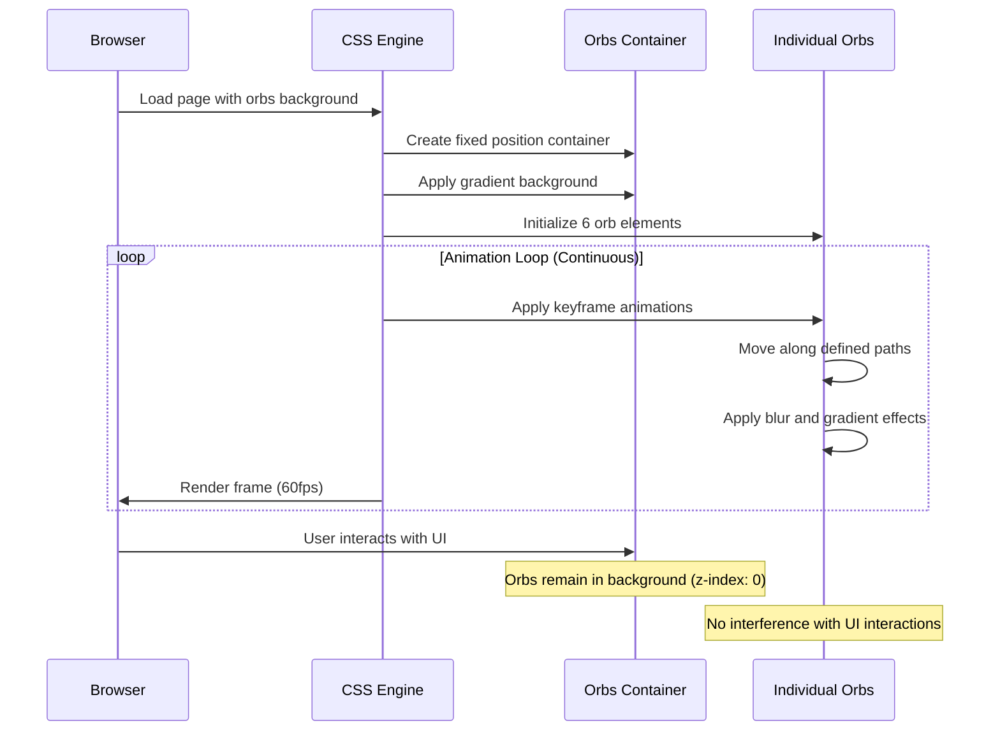

# Design Document: Animated Orbs Background

## Overview

This feature replaces the current static background image in the Orca V16 financial dashboard with a CSS-based animated orb background system. The design creates a dynamic, glassmorphic aesthetic with multiple animated orbs in cyan/blue and pink/magenta colors that move smoothly across a dark blue gradient background. The orbs use blur effects and gradients to create a glowing, ethereal appearance that complements the existing glassmorphic UI elements (.orca-card, .glass-panel classes) without interfering with user interactions.

The implementation uses pure CSS animations with keyframes for performance, avoiding JavaScript-based animation loops. Orbs are positioned absolutely in a dedicated background container with a lower z-index than UI elements, ensuring they remain purely decorative. The design is responsive and maintains visual consistency across different screen sizes.

## Architecture

```mermaid
graph TD
    A[Body Element] --> B[Orbs Background Container]
    A --> C[Main App Content]
    B --> D[Gradient Background Layer]
    B --> E[Orb Elements Layer]
    E --> F[Orb 1: Large Cyan]
    E --> G[Orb 2: Medium Pink]
    E --> H[Orb 3: Small Cyan]
    E --> I[Orb 4: Medium Magenta]
    E --> J[Orb 5: Large Blue]
    E --> K[Orb 6: Small Pink]
    C --> L[Glassmorphic UI Cards]
    
    style B fill:#1a1a2e
    style D fill:#0f3460
    style E fill:#16213e
    style F fill:#00dbe9
    style G fill:#ff6b9d
    style H fill:#00dbe9
    style I fill:#c44569
    style J fill:#0077b6
    style K fill:#ff6b9d
```



## Main Algorithm/Workflow



## Components and Interfaces

### Component 1: Orbs Background Container

**Purpose**: Serves as the fixed-position container for the gradient background and all animated orb elements

**CSS Interface**:
```css
.orbs-background {
  position: fixed;
  top: 0;
  left: 0;
  width: 100vw;
  height: 100vh;
  z-index: 0;
  overflow: hidden;
  pointer-events: none;
}
```

**Responsibilities**:
- Maintain fixed position covering entire viewport
- Ensure orbs stay behind all UI elements (z-index: 0)
- Prevent orbs from interfering with user interactions (pointer-events: none)
- Contain gradient background and orb elements

### Component 2: Gradient Background Layer

**Purpose**: Provides the dark blue gradient background that transitions from dark navy to lighter blue-teal

**CSS Interface**:
```css
.orbs-background::before {
  content: "";
  position: absolute;
  top: 0;
  left: 0;
  width: 100%;
  height: 100%;
  background: linear-gradient(135deg, #0a0e1a 0%, #1a2332 50%, #0f3460 100%);
  z-index: -1;
}
```

**Responsibilities**:
- Create smooth gradient transition from dark navy to blue-teal
- Serve as base layer for orb elements
- Maintain consistent background across viewport

### Component 3: Orb Elements

**Purpose**: Individual animated orb elements with gradients, blur effects, and smooth movement

**CSS Interface**:
```css
.orb {
  position: absolute;
  border-radius: 50%;
  filter: blur(60px);
  opacity: 0.6;
  animation-timing-function: ease-in-out;
  animation-iteration-count: infinite;
  animation-direction: alternate;
}
```

**Responsibilities**:
- Render circular gradient orbs with blur effects
- Animate smoothly across defined paths
- Maintain visual consistency with glassmorphic design
- Vary in size, color, position, and animation timing


## Data Models

### Model 1: Orb Configuration

```typescript
interface OrbConfig {
  id: string;
  size: number; // in pixels
  color: string; // CSS gradient or solid color
  initialPosition: { x: string; y: string }; // CSS position values (%, px, vw, vh)
  animationName: string; // keyframe animation name
  animationDuration: number; // in seconds
  animationDelay: number; // in seconds
  blur: number; // blur radius in pixels
  opacity: number; // 0 to 1
}
```

**Validation Rules**:
- size must be between 100 and 600 pixels
- opacity must be between 0.3 and 0.8 for subtle effect
- animationDuration must be between 15 and 40 seconds for smooth movement
- blur must be between 40 and 80 pixels for glowing effect

### Model 2: Orb Instances

Six orb instances with specific configurations:

```typescript
const orbInstances: OrbConfig[] = [
  {
    id: "orb-1",
    size: 500,
    color: "radial-gradient(circle, rgba(0, 219, 233, 0.8) 0%, rgba(0, 168, 181, 0.4) 50%, transparent 100%)",
    initialPosition: { x: "10%", y: "20%" },
    animationName: "float-1",
    animationDuration: 25,
    animationDelay: 0,
    blur: 60,
    opacity: 0.6
  },
  {
    id: "orb-2",
    size: 350,
    color: "radial-gradient(circle, rgba(255, 107, 157, 0.8) 0%, rgba(196, 69, 105, 0.4) 50%, transparent 100%)",
    initialPosition: { x: "70%", y: "10%" },
    animationName: "float-2",
    animationDuration: 30,
    animationDelay: 5,
    blur: 70,
    opacity: 0.5
  },
  // ... additional orbs
];
```


## Algorithmic Pseudocode

### Main Rendering Algorithm

```pascal
ALGORITHM renderOrbsBackground()
INPUT: None (uses CSS and HTML structure)
OUTPUT: Rendered animated orbs background

BEGIN
  // Step 1: Create container structure
  container ← CREATE_ELEMENT("div", class="orbs-background")
  SET container.style.position = "fixed"
  SET container.style.zIndex = 0
  SET container.style.pointerEvents = "none"
  
  // Step 2: Apply gradient background via CSS pseudo-element
  APPLY_CSS_RULE(".orbs-background::before", {
    background: "linear-gradient(135deg, #0a0e1a 0%, #1a2332 50%, #0f3460 100%)"
  })
  
  // Step 3: Create and configure orb elements
  FOR each orbConfig IN orbInstances DO
    orb ← CREATE_ELEMENT("div", class="orb", id=orbConfig.id)
    
    SET orb.style.width = orbConfig.size + "px"
    SET orb.style.height = orbConfig.size + "px"
    SET orb.style.background = orbConfig.color
    SET orb.style.left = orbConfig.initialPosition.x
    SET orb.style.top = orbConfig.initialPosition.y
    SET orb.style.filter = "blur(" + orbConfig.blur + "px)"
    SET orb.style.opacity = orbConfig.opacity
    SET orb.style.animation = orbConfig.animationName + " " + 
                               orbConfig.animationDuration + "s " +
                               orbConfig.animationDelay + "s " +
                               "ease-in-out infinite alternate"
    
    APPEND orb TO container
  END FOR
  
  // Step 4: Insert container as first child of body
  INSERT container AS_FIRST_CHILD_OF document.body
  
  // Step 5: CSS animation engine handles continuous rendering
  // No JavaScript animation loop required
END
```

**Preconditions:**
- Document body exists and is accessible
- CSS keyframe animations are defined
- orbInstances configuration array is valid

**Postconditions:**
- Orbs background container is rendered as first child of body
- All orb elements are created and animated
- Background remains behind all UI elements (z-index: 0)
- Animations run continuously without JavaScript intervention

**Loop Invariants:**
- All orb elements maintain their blur and opacity properties
- Container remains fixed and non-interactive throughout


### Animation Keyframes Algorithm

```pascal
ALGORITHM defineOrbAnimations()
INPUT: None
OUTPUT: CSS keyframe definitions for orb movement

BEGIN
  // Float-1: Diagonal movement (top-left to bottom-right)
  DEFINE_KEYFRAME("float-1") {
    0%: { transform: "translate(0, 0)" }
    100%: { transform: "translate(30vw, 40vh)" }
  }
  
  // Float-2: Circular movement
  DEFINE_KEYFRAME("float-2") {
    0%: { transform: "translate(0, 0)" }
    25%: { transform: "translate(-20vw, 15vh)" }
    50%: { transform: "translate(-10vw, 35vh)" }
    75%: { transform: "translate(10vw, 25vh)" }
    100%: { transform: "translate(0, 0)" }
  }
  
  // Float-3: Vertical oscillation
  DEFINE_KEYFRAME("float-3") {
    0%: { transform: "translateY(0)" }
    100%: { transform: "translateY(50vh)" }
  }
  
  // Float-4: Horizontal wave
  DEFINE_KEYFRAME("float-4") {
    0%: { transform: "translate(0, 0)" }
    50%: { transform: "translate(-25vw, 10vh)" }
    100%: { transform: "translate(0, 0)" }
  }
  
  // Float-5: Large diagonal sweep
  DEFINE_KEYFRAME("float-5") {
    0%: { transform: "translate(0, 0)" }
    100%: { transform: "translate(-35vw, -20vh)" }
  }
  
  // Float-6: Small circular orbit
  DEFINE_KEYFRAME("float-6") {
    0%: { transform: "translate(0, 0) rotate(0deg)" }
    100%: { transform: "translate(15vw, 20vh) rotate(360deg)" }
  }
END
```

**Preconditions:**
- CSS supports @keyframes syntax
- Transform properties are supported by browser

**Postconditions:**
- Six unique animation patterns are defined
- Animations use viewport units (vw, vh) for responsiveness
- Each animation creates distinct movement pattern


## Key Functions with Formal Specifications

### Function 1: createOrbsBackground()

```typescript
function createOrbsBackground(): HTMLDivElement
```

**Preconditions:**
- Document is loaded and body element exists
- CSS styles for .orbs-background are defined

**Postconditions:**
- Returns a div element with class "orbs-background"
- Element has fixed positioning and z-index 0
- Element has pointer-events: none
- Element is ready to contain orb elements

**Loop Invariants:** N/A (no loops in function)

### Function 2: createOrb()

```typescript
function createOrb(config: OrbConfig): HTMLDivElement
```

**Preconditions:**
- config is a valid OrbConfig object
- config.size is between 100 and 600
- config.opacity is between 0.3 and 0.8
- config.animationName corresponds to a defined keyframe

**Postconditions:**
- Returns a div element with class "orb"
- Element has all styles from config applied
- Element has animation configured with specified duration and delay
- Element is positioned absolutely at initialPosition

**Loop Invariants:** N/A (no loops in function)

### Function 3: removeStaticBackground()

```typescript
function removeStaticBackground(): void
```

**Preconditions:**
- body element has background-image style set

**Postconditions:**
- body.style.backgroundImage is set to "none"
- body.style.backgroundColor is set to "#000"
- Static background is no longer visible

**Loop Invariants:** N/A (no loops in function)


## Example Usage

### Example 1: Basic CSS Implementation

```css
/* Add to index.css */

/* Orbs background container */
.orbs-background {
  position: fixed;
  top: 0;
  left: 0;
  width: 100vw;
  height: 100vh;
  z-index: 0;
  overflow: hidden;
  pointer-events: none;
}

/* Gradient background layer */
.orbs-background::before {
  content: "";
  position: absolute;
  top: 0;
  left: 0;
  width: 100%;
  height: 100%;
  background: linear-gradient(135deg, #0a0e1a 0%, #1a2332 50%, #0f3460 100%);
  z-index: -1;
}

/* Base orb styling */
.orb {
  position: absolute;
  border-radius: 50%;
  filter: blur(60px);
  opacity: 0.6;
  animation-timing-function: ease-in-out;
  animation-iteration-count: infinite;
  animation-direction: alternate;
}

/* Individual orb configurations */
.orb-1 {
  width: 500px;
  height: 500px;
  background: radial-gradient(circle, rgba(0, 219, 233, 0.8) 0%, rgba(0, 168, 181, 0.4) 50%, transparent 100%);
  top: 20%;
  left: 10%;
  animation: float-1 25s ease-in-out infinite alternate;
}

.orb-2 {
  width: 350px;
  height: 350px;
  background: radial-gradient(circle, rgba(255, 107, 157, 0.8) 0%, rgba(196, 69, 105, 0.4) 50%, transparent 100%);
  top: 10%;
  right: 20%;
  animation: float-2 30s 5s ease-in-out infinite alternate;
  filter: blur(70px);
  opacity: 0.5;
}

/* Keyframe animations */
@keyframes float-1 {
  0% { transform: translate(0, 0); }
  100% { transform: translate(30vw, 40vh); }
}

@keyframes float-2 {
  0% { transform: translate(0, 0); }
  25% { transform: translate(-20vw, 15vh); }
  50% { transform: translate(-10vw, 35vh); }
  75% { transform: translate(10vw, 25vh); }
  100% { transform: translate(0, 0); }
}
```


### Example 2: HTML Structure

```html
<!-- Add to index.html or create via JavaScript in main.tsx -->
<body>
  <!-- Orbs background (first child, z-index: 0) -->
  <div class="orbs-background">
    <div class="orb orb-1"></div>
    <div class="orb orb-2"></div>
    <div class="orb orb-3"></div>
    <div class="orb orb-4"></div>
    <div class="orb orb-5"></div>
    <div class="orb orb-6"></div>
  </div>
  
  <!-- Main app content (z-index > 0) -->
  <div id="root"></div>
</body>
```

### Example 3: TypeScript/React Integration

```typescript
// In main.tsx, before React render
function initializeOrbsBackground() {
  // Remove static background from body
  document.body.style.backgroundImage = "none";
  document.body.style.backgroundColor = "#000";
  
  // Create orbs container
  const orbsContainer = document.createElement("div");
  orbsContainer.className = "orbs-background";
  
  // Create 6 orb elements
  for (let i = 1; i <= 6; i++) {
    const orb = document.createElement("div");
    orb.className = `orb orb-${i}`;
    orbsContainer.appendChild(orb);
  }
  
  // Insert as first child of body
  document.body.insertBefore(orbsContainer, document.body.firstChild);
}

// Call before React render
initializeOrbsBackground();

ReactDOM.createRoot(document.getElementById('root')!).render(
  <React.StrictMode>
    <App />
  </React.StrictMode>
);
```


## Correctness Properties

*A property is a characteristic or behavior that should hold true across all valid executions of a system—essentially, a formal statement about what the system should do. Properties serve as the bridge between human-readable specifications and machine-verifiable correctness guarantees.*

### Property 1: Orb Class Naming Consistency

For any orb element, it must have both the base "orb" class and a unique identifier class in the format "orb-N" where N is between 1 and 6.

**Validates: Requirements 3.2**

### Property 2: Orb Size Constraints

For any orb element, the width and height must be between 100 and 600 pixels inclusive.

**Validates: Requirements 3.3**

### Property 3: Orb Gradient Background Type

For any orb element, the background must be a radial gradient with colors in either the cyan/blue family or the pink/magenta family.

**Validates: Requirements 3.4**

### Property 4: Orb Blur Filter Range

For any orb element, the blur filter value must be between 40 and 80 pixels inclusive, with an upper bound of 80 pixels for performance.

**Validates: Requirements 3.5, 11.3**

### Property 5: Orb Opacity Range

For any orb element, the opacity must be between 0.3 and 0.8 inclusive to maintain subtle visual effect without overpowering glassmorphic UI.

**Validates: Requirements 3.6, 12.3**

### Property 6: Orb Circular Shape

For any orb element, the border-radius must be set to 50% to create a circular shape.

**Validates: Requirements 4.1**

### Property 7: Orb Radial Gradient Structure

For any orb element, the background gradient must be radial with color intensity decreasing from center to edge (higher opacity at center, transparent at edge).

**Validates: Requirements 4.2**

### Property 8: Orb Blur Filter Presence

For any orb element, the filter property must include a blur() function to create the glowing effect.

**Validates: Requirements 4.5**

### Property 9: Orb Animation Configuration

For any orb element, it must have a CSS animation applied with a unique animation-name corresponding to a defined keyframe.

**Validates: Requirements 5.1**

### Property 10: Orb Animation Duration Range

For any orb element, the animation-duration must be between 15 and 40 seconds inclusive.

**Validates: Requirements 5.2**

### Property 11: Orb Animation Timing Function

For any orb element, the animation-timing-function must be set to ease-in-out for smooth acceleration and deceleration.

**Validates: Requirements 5.3**

### Property 12: Orb Animation Infinite Iteration

For any orb element, the animation-iteration-count must be set to infinite for continuous movement.

**Validates: Requirements 5.4**

### Property 13: Orb Animation Alternate Direction

For any orb element, the animation-direction must be set to alternate to create back-and-forth movement.

**Validates: Requirements 5.5**

### Property 14: Orb Animation Delay Variation

For any two different orb elements, their animation-delay values must differ to create staggered movement patterns.

**Validates: Requirements 5.6**

### Property 15: Keyframe Transform Usage

For any animation keyframe definition, it must use the CSS transform property (not top, left, width, or height) for GPU-accelerated movement.

**Validates: Requirements 6.2, 6.5, 11.1**

### Property 16: Keyframe Viewport Units

For any animation keyframe definition, the transform values must include viewport units (vw or vh) for responsive movement scaling.

**Validates: Requirements 6.3, 10.4**


## Error Handling

### Error Scenario 1: CSS Animation Not Supported

**Condition**: Browser does not support CSS animations or @keyframes
**Response**: Orbs render as static elements at their initial positions with blur and gradient effects
**Recovery**: Graceful degradation - background remains visually appealing without animation

### Error Scenario 2: Performance Degradation

**Condition**: Device has limited GPU resources causing animation lag or dropped frames
**Response**: CSS animations automatically throttle to maintain best possible performance
**Recovery**: Browser's CSS engine handles optimization; no JavaScript intervention needed

### Error Scenario 3: Z-Index Conflict

**Condition**: Existing UI elements have z-index values that conflict with orbs background
**Response**: Orbs background uses z-index: 0, which should be lower than all UI elements
**Recovery**: If conflict occurs, adjust orbs background to z-index: -1 or adjust UI element z-index values

### Error Scenario 4: Static Background Removal Fails

**Condition**: Static background image cannot be removed or overridden
**Response**: Orbs background may layer on top of static background
**Recovery**: Ensure body background-image is set to "none" in CSS with !important if necessary

## Testing Strategy

### Unit Testing Approach

**CSS Rendering Tests**:
- Verify orbs background container has correct positioning (fixed, z-index: 0)
- Verify gradient background renders with correct color stops
- Verify each orb element has correct size, color, blur, and opacity
- Verify pointer-events: none is applied to prevent interaction capture

**DOM Structure Tests**:
- Verify orbs background container is first child of body element
- Verify 6 orb elements exist within container
- Verify each orb has unique class name (orb-1 through orb-6)

**Animation Configuration Tests**:
- Verify each orb has animation property set
- Verify animation durations are within expected range (15-40s)
- Verify animation timing function is ease-in-out
- Verify animation iteration count is infinite
- Verify animation direction is alternate


### Integration Testing Approach

**Visual Regression Tests**:
- Capture screenshots of orbs background at different viewport sizes
- Compare against reference images to ensure visual consistency
- Verify glassmorphic UI elements render correctly over orbs background

**Interaction Tests**:
- Verify clicking on UI elements works correctly (orbs don't capture events)
- Verify hovering over UI elements triggers correct hover states
- Verify scrolling works smoothly without orbs interfering

**Cross-Browser Tests**:
- Test in Chrome, Firefox, Safari, Edge
- Verify animations run smoothly in all browsers
- Verify gradient rendering is consistent across browsers

**Responsive Tests**:
- Test at mobile (375px), tablet (768px), and desktop (1920px) widths
- Verify orbs scale appropriately with viewport
- Verify animations use viewport units correctly

## Performance Considerations

**GPU Acceleration**:
- CSS transforms and opacity changes trigger GPU acceleration
- Blur filter may be GPU-accelerated on modern browsers
- Avoid layout-triggering properties (width, height, top, left changes during animation)

**Animation Optimization**:
- Use transform for movement (GPU-accelerated) instead of top/left
- Limit number of orbs to 6 for optimal performance
- Use alternate direction to avoid animation restart overhead
- Stagger animation delays to distribute GPU load

**Memory Usage**:
- Fixed number of DOM elements (1 container + 6 orbs = 7 elements)
- No JavaScript animation loops or requestAnimationFrame calls
- CSS animations handled by browser's optimized rendering engine

**Rendering Performance**:
- Target 60fps for smooth animations
- Blur filter is most expensive operation - limit blur radius to 60-80px
- Use radial gradients instead of complex multi-stop gradients
- Opacity values between 0.3-0.8 reduce overdraw


## Security Considerations

**No Security Risks**:
- Pure CSS implementation with no JavaScript execution
- No external resources loaded (no CDN dependencies)
- No user input processed
- No data storage or transmission
- No XSS or injection vectors

**Content Security Policy (CSP) Compliance**:
- Inline styles may require 'unsafe-inline' in style-src directive
- Consider moving all styles to external CSS file for stricter CSP
- No eval() or dynamic code execution

## Dependencies

**Browser Requirements**:
- CSS3 animations support (@keyframes)
- CSS transforms support (translate, rotate)
- CSS filters support (blur)
- CSS gradients support (radial-gradient, linear-gradient)
- Viewport units support (vw, vh)

**Minimum Browser Versions**:
- Chrome 43+ (June 2015)
- Firefox 16+ (October 2012)
- Safari 9+ (September 2015)
- Edge 12+ (July 2015)

**Project Dependencies**:
- No additional npm packages required
- Uses existing React + TypeScript + Vite setup
- Integrates with existing Tailwind CSS configuration
- Compatible with existing glassmorphic styles (.orca-card, .glass-panel)

**CSS Framework Integration**:
- Tailwind CSS: No conflicts, orbs use custom CSS classes
- Existing index.css: Append orbs styles to existing file
- No CSS preprocessor required (pure CSS)
